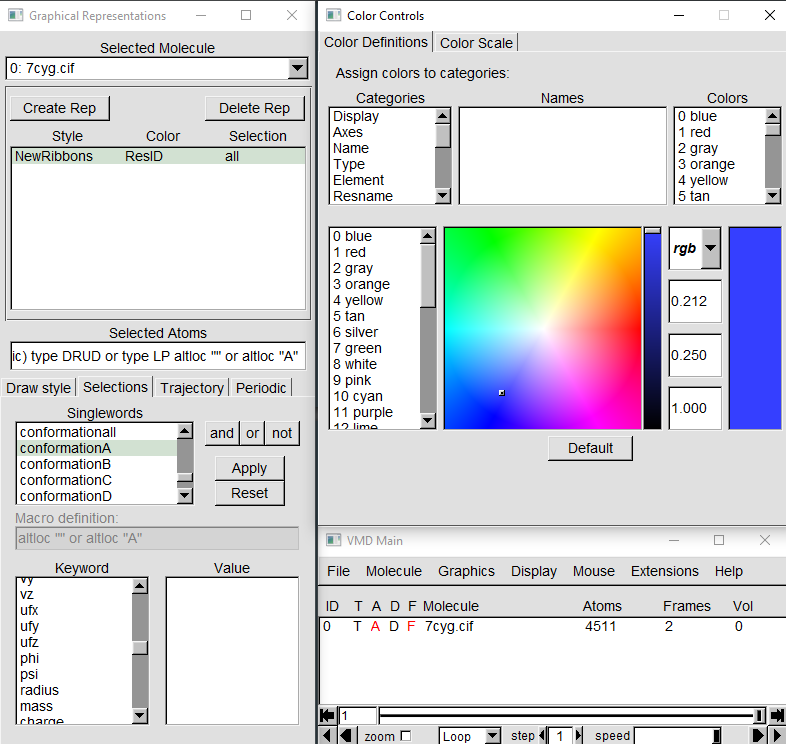
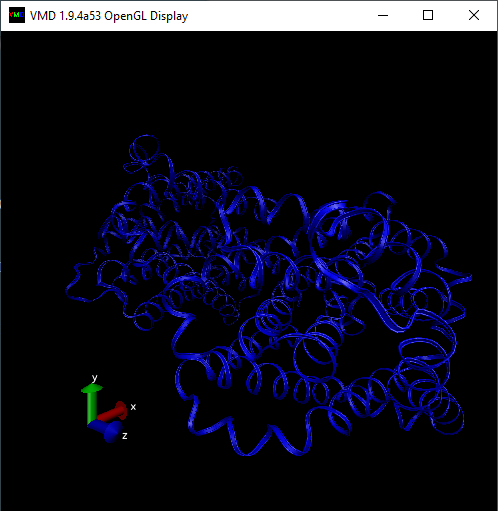
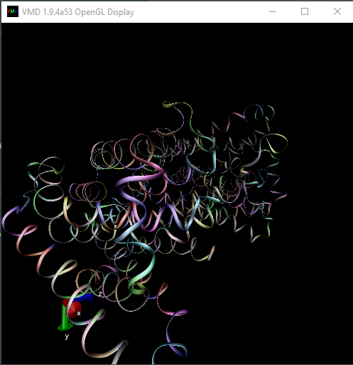
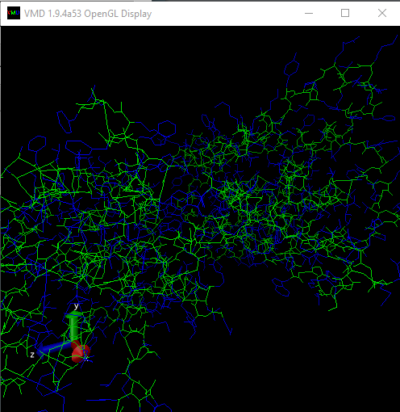
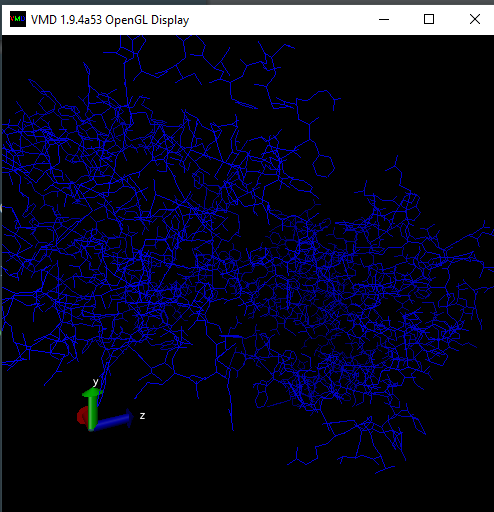

# lab5

* Выбранная структура белка среднего размера на Protein Data Bank: https://www.rcsb.org/structure/7CYG
* Для визуализации использован VMD

### VMD:
Можно выбрать любые цвета в определении цветов и изменить атомарное выделение нужно открыть вкладку выделения, т.е мы можем изменить как окраску, так и метод рисования, также изменить ползунки для любого метода окраски

### Результаты:

Ribbons

New ribbons

Backbone

Molecule

